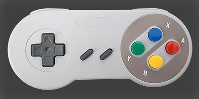

# drmfb32
A C++ library and code for using the DRM/KMS 32 bit dumbbuffer.

Please note that this is a work in progress and mostly for my own use. I often make changes that break compatibility with older versions.

## Submodules

This project uses [BS::thread_pool](https://github.com/bshoshany/thread-pool) by Barak Shoshany as a submodule. You will need to run the following git commmands after cloning this repository

    git submodule update --init

## Libraries

This project uses the following libraries. You will need to install the developer packages to compile all the programs.

* libbsd
* libdrm
* libfmt
* libfreetype2
* libturbojpeg

It uses pkg-config to find these libraries.

## Build

This project uses CMake. To build

     mkdir build
     cd build
     cmake ..
     make

You can speed up the build on mulit-core systems by using

    make -j $(nproc)

## SNES style controller

Some of the programs bellow use the Linux Joystick interface for input.
The programs are written for a SNES style controller with

* control pad
* A, B, X and Y buttons
* Select and Start buttons
* Left and Right shoulder buttons

These programs are marked with a [J]

### [Joystick configuration](joystick/README.md)

One of the problems with using SNES style controllers is that there is no standard mapping of the buttons to the button numbers in the Linux Kernel API. I have created a text configuration program that will write a configuration filed `${HOME}/.config/drmfb32/joystickButtons` that holds the mapping from the button names to the button numbers.

## Programs and examples

### [Boxworld](boxworld/README.md) [J]

A version of Boxworld or Sokoban.

### [Info](info/README.md)

Graph various system information.

### [Life](life/README.md) [J]

A version of Conway's Game of Life.

### [Modes](modes/README.md)

### [Puzzle-15](puzzle-15/README.md) [J]

Sliding 15 puzzle.

### [Showcam](showcam/README.md)

Display a webcam stream.

### [Showjpeg](showjpeg/README.md)

Display a jpeg image.

### [Showqoi](showqoi/README.md)

Display a Quite OK Image format (QOI) File.

### [Slideshow](slideshow/README.md) [J]

Slide show of all jpeg files in a directory and its subdirectories.

### [Sphere](sphere/README.md)

An animated shaded sphere.

### [Test](test/README.md)

Programs to test various parts of the library.

## The down side of double buffering

I created a bug by enabling double buffering. When you draw persisently and directly to the frame buffer you need to make sure that you draw to both front and back buffers. I have added a convenience function clearBuffer() that will clear the front and back buffers.

## Possible Future Features
* Atomic commit
* Overlay planes
