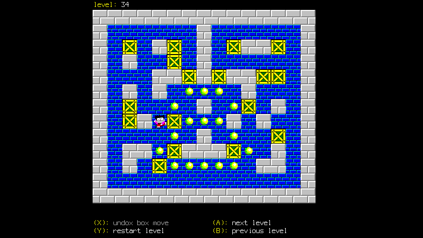

# Boxworld

A version of Boxworld or Sokoban using a DRM/KMS dumbbuffer, written in C++.

This version of Boxworld has the same 100 levels that are found in the Windows 3.1 version of Boxworld from 1992.

The aim of the game is to place all of the yellow boxes on the spaces with the yellow dots. Place boxes by pushing them using the animated character. The boxes change colour to red when they are placed on the yellow dots. You can only push the boxes, they can't be pulled. The level is complete when all boxes are in place.

# usage
        boxworld <options>

        --connector,-c - dri connector to use
        --device,-d - dri device to use
        --help,-h - print usage and exit
        --joystick,-j - joystick device

## Controls:-
- Move the character via a D-pad.
- (A) move to the next level.
- (B) move to the previous level.
- (X) Undo the last box move. There is only one level of undo.
- (Y) restart the current level from the beginning.
- [Start Button] Exit.

## Level: 34

