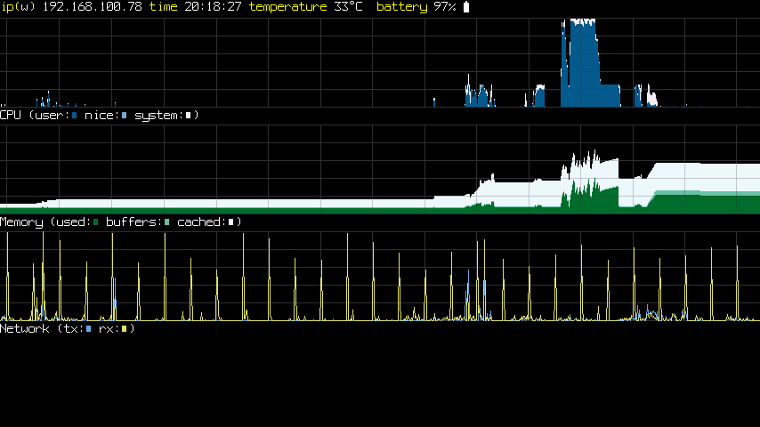

# ogsinfo
Program to display Odroid Go Super specific system information directly on the
framebuffer.
# usage
        ogsinfo <options>

        --daemon,-D - start in the background as a daemon
        --device,-d - framebuffer device to use (default is /dev/fb0)
        --help,-h - print usage and exit
        --pidfile,-p <pidfile> - create and lock PID file (if being run as a daemon)
# build
see main readme.
# install
    sudo make install
    sudo cp ../ogsinfo/ogsinfo@.service /lib/systemd/system/
    sudo systemctl daemon-reload
    sudo systemctl enable ogsinfo@0.service
    sudo systemctl start ogsinfo@0

